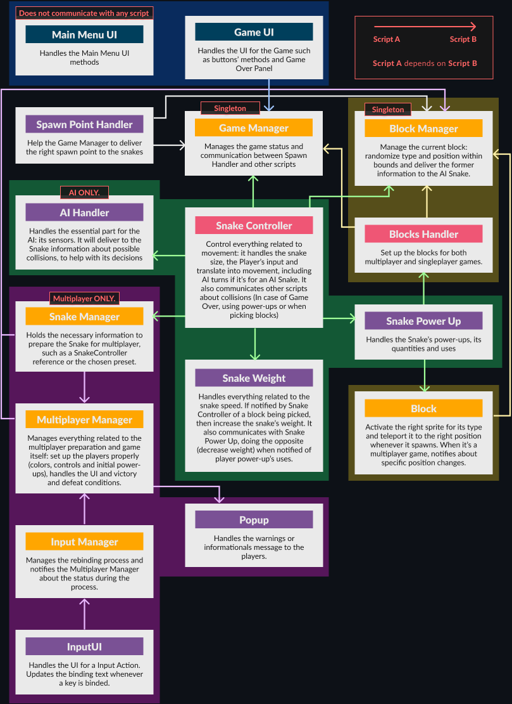

# This README may be outdated for this branch.
***
# Snake Game
## How do I access the game?
Click [here](https://jasbrela.itch.io/snake-game) to go to the [itch.io](https://itch.io) game's page. It may take up to two minutes to load if it's the first time.

## How do I play?
This is a Snake game where you play against AI. You should pick up the blocks wisely, as each one of them has pros and cons.

### Blocks
Each block you pick will slow down your snake a little bit. The power-ups are accumulative.
1. **ENGINE POWER BLOCK:** This will make your snake run faster, instead of slowing down.
2. **BATTERING RAM BLOCK:** This will protect your snake by one block if happens to you to hit the enemy body.

### Controls
- Press **A** to turn left
- Press **D** to turn right.

## Code Architecture Diagram
